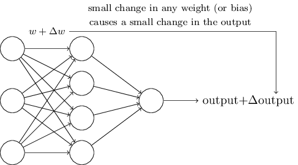
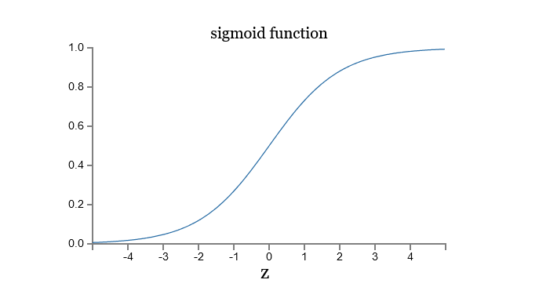
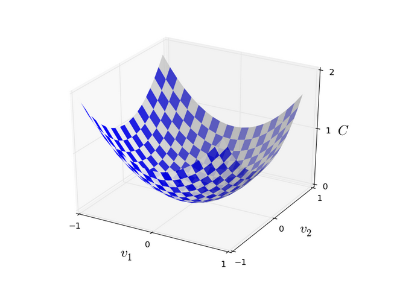

# Main Points Learned

### 1. Perceptron Neuron
- The perceptron is a simple model of a neuron, taking multiple binary "0's and 1's" inputs and producing a single binary output.
- The output is determined by whether the weighted sum of the inputs exceeds a certain threshold which can b called bias.
- Perceptrons can represent simple logical functions like NAND.

```math
\text{output} =
\begin{cases}
0 & \text{if } \sum_j w_j x_j \leq \text{threshold} \\
1 & \text{if } \sum_j w_j x_j > \text{threshold}
\end{cases}

```


### 2. Sigmoid Neuron
- Sigmoid neurons are a perceptrons. but instead of just 0's and 1's its the range of numbers between them.
- The decimal inputs allows us to make small changes that results a small change for output like gradient-based techniques.

    ```math
    \Delta \text{output} \approx \sum_j \frac{\partial \text{output}}{\partial w_j} \Delta w_j + \frac{\partial \text{output}}{\partial b} \Delta b
    ```
    
    

- Sigmoid neurons are useful for more complex functions.
    - **segmoid function** : used to squish the output to be in range of 0,1
        ```math
        \sigma(z) \equiv \frac{1}{1 + e^{-z}}
        \\\
        \\\
        \\\text{where z = }
        \sum_j w_j x_j - b
        ```
        

### 3. Feedforward Neural Network
- A feedforward neural network is a network of neurons where the information moves in one direction — from input to output .
- These networks are made up of layers: input layer, hidden layers, and output layer.
- Each neuron in a layer is connected to all neurons in the next layer.

    

### 4. Gradient Descent Algorithm
- Gradient descent is a method to minimize errors of the network by adjusting weights.
- This is done by  the **cost function**:
```math
C(w, b) \equiv \frac{1}{2n} \left( \sum_x \| y(x) - a \|^2 \right)
\\\
\\\text{where a is the target output value and y(x) is the actual output }
```
- The error is reduced iteratively by calculating the gradient of the cost function to find the minimum point which represent minimum error and moving in the direction of steepest descent.
    - here is a example for how it looks for 3dimensional cost function that has 2 ionputs
    

```math 
        \nabla C \equiv \left( \frac{\partial C}{\partial v_1}, \frac{\partial C}{\partial v_2} \right)^T
        \\\
        \\\
        \Delta C \approx \frac{\partial C}{\partial v_1} \Delta v_1 + \frac{\partial C}{\partial v_2} \Delta v_2 = \nabla C \cdot \Delta v
        \\\
        \\\
        \text{where v is } \left(\sum_x \| y(x) - a \|^2 \right) 
        \text{ for 2 dimensions only}
```
- now to make this small changes in v :
    - **Δv = -η ∇C** where η is the learning rate a small positive number so that **v' = v - η ∇C**
    - same is done for b and w


### 5. Stochastic Gradient Descent (SGD)
- Stochastic Gradient Descent is calculating the gradient for a random set of the input data set rather than for the entire dataset at once.
- This makes SGD more efficient for large datasets.

### 6. Code to Build the Neural Network

```python
import random

# Third-party libraries
import numpy as np

class Network(object):

    def __init__(self, sizes):
        """The list ``sizes`` contains the number of neurons in the
        respective layers of the network.  For example, if the list
        was [2, 3, 1] then it would be a three-layer network, with the
        first layer containing 2 neurons, the second layer 3 neurons,
        and the third layer 1 neuron.  The biases and weights for the
        network are initialized randomly, using a Gaussian
        distribution with mean 0, and variance 1.  Note that the first
        layer is assumed to be an input layer, and by convention we
        won't set any biases for those neurons, since biases are only
        ever used in computing the outputs from later layers."""
        self.num_layers = len(sizes)
        self.sizes = sizes
        self.biases = [np.random.randn(y, 1) for y in sizes[1:]]
        self.weights = [np.random.randn(y, x)
                        for x, y in zip(sizes[:-1], sizes[1:])]

    def feedforward(self, a):
        """Return the output of the network if ``a`` is input."""
        for b, w in zip(self.biases, self.weights):
            a = sigmoid(np.dot(w, a)+b)
        return a

    def SGD(self, training_data, epochs, mini_batch_size, eta,
            test_data=None):
        """Train the neural network using mini-batch stochastic
        gradient descent.  The ``training_data`` is a list of tuples
        ``(x, y)`` representing the training inputs and the desired
        outputs.  The other non-optional parameters are
        self-explanatory.  If ``test_data`` is provided then the
        network will be evaluated against the test data after each
        epoch, and partial progress printed out.  This is useful for
        tracking progress, but slows things down substantially."""
        if test_data: n_test = len(test_data)
        n = len(training_data)
        for j in xrange(epochs):
            random.shuffle(training_data)
            mini_batches = [
                training_data[k:k+mini_batch_size]
                for k in xrange(0, n, mini_batch_size)]
            for mini_batch in mini_batches:
                self.update_mini_batch(mini_batch, eta)
            if test_data:
                print "Epoch {0}: {1} / {2}".format(
                    j, self.evaluate(test_data), n_test)
            else:
                print "Epoch {0} complete".format(j)

    def update_mini_batch(self, mini_batch, eta):
        """Update the network's weights and biases by applying
        gradient descent using backpropagation to a single mini batch.
        The ``mini_batch`` is a list of tuples ``(x, y)``, and ``eta``
        is the learning rate."""
        nabla_b = [np.zeros(b.shape) for b in self.biases]
        nabla_w = [np.zeros(w.shape) for w in self.weights]
        for x, y in mini_batch:
            delta_nabla_b, delta_nabla_w = self.backprop(x, y)
            nabla_b = [nb+dnb for nb, dnb in zip(nabla_b, delta_nabla_b)]
            nabla_w = [nw+dnw for nw, dnw in zip(nabla_w, delta_nabla_w)]
        self.weights = [w-(eta/len(mini_batch))*nw
                        for w, nw in zip(self.weights, nabla_w)]
        self.biases = [b-(eta/len(mini_batch))*nb
                       for b, nb in zip(self.biases, nabla_b)]

    def backprop(self, x, y):
        """Return a tuple ``(nabla_b, nabla_w)`` representing the
        gradient for the cost function C_x.  ``nabla_b`` and
        ``nabla_w`` are layer-by-layer lists of numpy arrays, similar
        to ``self.biases`` and ``self.weights``."""
        nabla_b = [np.zeros(b.shape) for b in self.biases]
        nabla_w = [np.zeros(w.shape) for w in self.weights]
        # feedforward
        activation = x
        activations = [x] # list to store all the activations, layer by layer
        zs = [] # list to store all the z vectors, layer by layer
        for b, w in zip(self.biases, self.weights):
            z = np.dot(w, activation)+b
            zs.append(z)
            activation = sigmoid(z)
            activations.append(activation)
        # backward pass
        delta = self.cost_derivative(activations[-1], y) * \
            sigmoid_prime(zs[-1])
        nabla_b[-1] = delta
        nabla_w[-1] = np.dot(delta, activations[-2].transpose())
        # Note that the variable l in the loop below is used a little
        # differently to the notation in Chapter 2 of the book.  Here,
        # l = 1 means the last layer of neurons, l = 2 is the
        # second-last layer, and so on.  It's a renumbering of the
        # scheme in the book, used here to take advantage of the fact
        # that Python can use negative indices in lists.
        for l in xrange(2, self.num_layers):
            z = zs[-l]
            sp = sigmoid_prime(z)
            delta = np.dot(self.weights[-l+1].transpose(), delta) * sp
            nabla_b[-l] = delta
            nabla_w[-l] = np.dot(delta, activations[-l-1].transpose())
        return (nabla_b, nabla_w)

    def evaluate(self, test_data):
        """Return the number of test inputs for which the neural
        network outputs the correct result. Note that the neural
        network's output is assumed to be the index of whichever
        neuron in the final layer has the highest activation."""
        test_results = [(np.argmax(self.feedforward(x)), y)
                        for (x, y) in test_data]
        return sum(int(x == y) for (x, y) in test_results)

    def cost_derivative(self, output_activations, y):
        """Return the vector of partial derivatives \partial C_x /
        \partial a for the output activations."""
        return (output_activations-y)

#### Miscellaneous functions
def sigmoid(z):
    """The sigmoid function."""
    return 1.0/(1.0+np.exp(-z))

def sigmoid_prime(z):
    """Derivative of the sigmoid function."""
    return sigmoid(z)*(1-sigmoid(z))